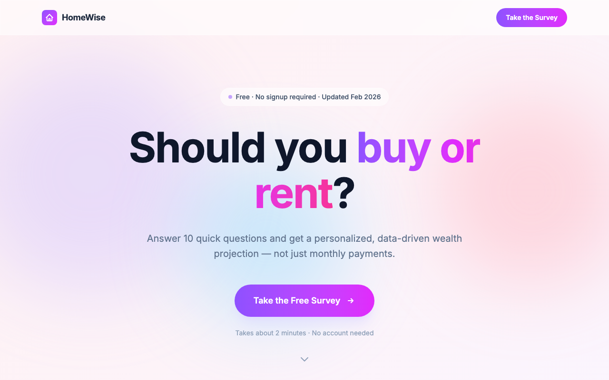
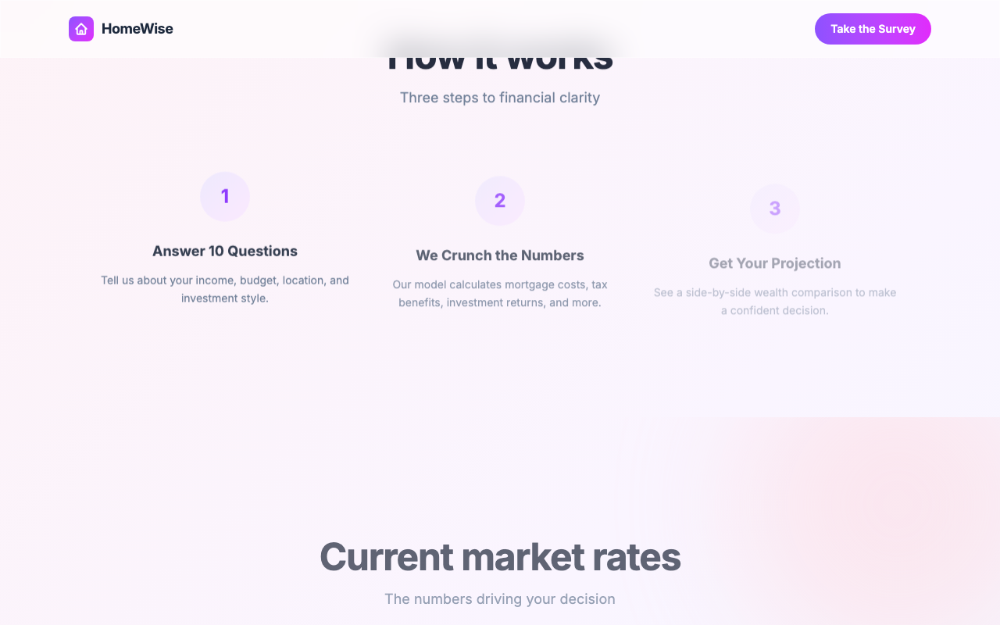
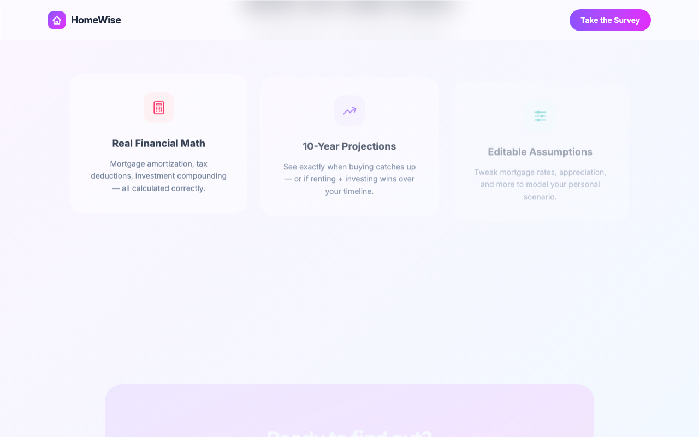
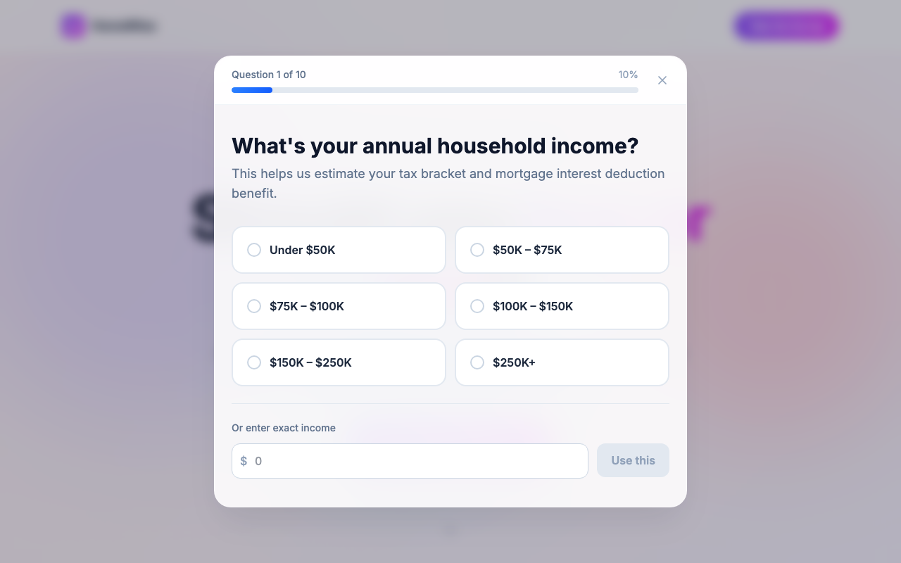
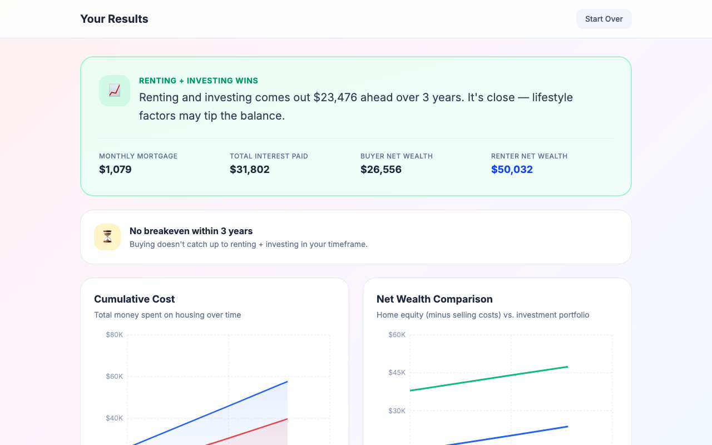
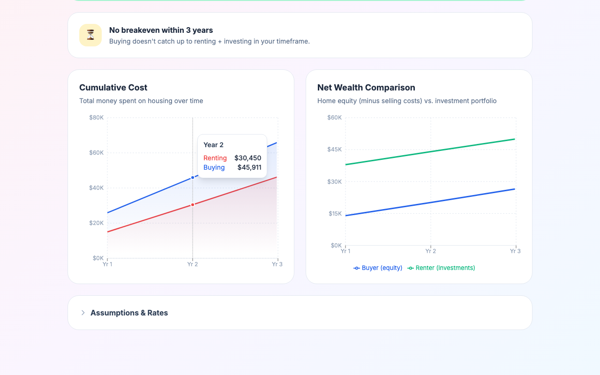

# HomeWise — Rent vs. Buy Calculator

A sleek, data-driven financial tool that helps you decide whether to **buy a home** or **keep renting and investing** the difference. Built with React 19, TypeScript, and Tailwind CSS v4.

> Answer 10 quick questions → get a personalized wealth projection with charts, breakeven analysis, and editable assumptions.

---

## Screenshots

### Landing Page

Apple-inspired design with animated pastel gradient blobs, glassmorphism cards, and scroll-triggered reveal animations.







### Wizard Survey (Modal Overlay)

The 10-question wizard runs as a modal overlay on top of the landing page. Users can quit anytime (X button, Escape, or backdrop click) and resume where they left off.



### Results Dashboard

Personalized recommendation with financial stats, cumulative cost chart, net wealth comparison, breakeven indicator, and an editable assumptions panel.





---

## Tech Stack

| Layer | Technology |
|-------|-----------|
| Framework | React 19 |
| Language | TypeScript (strict mode) |
| Build | Vite 7 |
| Styling | Tailwind CSS v4 (`@tailwindcss/vite` plugin) |
| Charts | Recharts 3 |
| Testing | Vitest 4 + Testing Library + jsdom |
| State | `useReducer` + React Context (no external state libs) |

---

## Architecture

```
src/
├── components/
│   ├── landing/
│   │   └── LandingPage.tsx          # Apple-style multi-section scroll page
│   ├── wizard/
│   │   ├── WizardModal.tsx          # Dialog overlay with backdrop blur
│   │   ├── WizardContainer.tsx      # Full-page wizard (legacy, unused)
│   │   ├── QuestionStep.tsx         # Single question renderer
│   │   ├── OptionCard.tsx           # Selectable option button
│   │   └── CustomValueInput.tsx     # Freeform dollar/percent/years input
│   ├── results/
│   │   ├── ResultsDashboard.tsx     # Full results page with charts
│   │   ├── SummaryCard.tsx          # Recommendation + stats card
│   │   ├── CostComparisonChart.tsx  # Cumulative cost area chart
│   │   ├── WealthChart.tsx          # Net wealth line chart
│   │   ├── BreakevenIndicator.tsx   # Breakeven year indicator
│   │   └── AssumptionsEditor.tsx    # 6 sliders for rate overrides
│   └── ui/
│       ├── ProgressBar.tsx          # Step progress indicator
│       └── ScrollReveal.tsx         # IntersectionObserver scroll animation
├── context/
│   └── WizardContext.tsx            # Central state: reducer + provider + hook
├── lib/
│   ├── calculations.ts             # Financial projection engine
│   ├── constants.ts                # Questions, defaults, location data
│   └── types.ts                    # All TypeScript interfaces
├── test/
│   └── setup.ts                    # Vitest global setup + IO mock
├── __tests__/
│   ├── unit/                       # Pure logic tests (calculations, reducer, constants)
│   ├── components/                 # Component rendering + interaction tests
│   └── integration/                # Full wizard flow + page navigation tests
├── App.tsx                         # View router (landing / wizard / results)
├── index.css                       # Pastel theme, blob animations, glass utility
└── main.tsx                        # Entry point
```

### View Routing (No Router Library)

Navigation is state-driven via `WizardContext`:

```
┌──────────────────────────────────────────────────────┐
│                    App.tsx                            │
│                                                      │
│  view === 'results'  →  <ResultsDashboard />         │
│                                                      │
│  view === 'landing'  →  <LandingPage />              │
│  view === 'wizard'   →  <LandingPage />              │
│                         + <WizardModal /> (overlay)   │
└──────────────────────────────────────────────────────┘
```

### State Management

A single `useReducer` manages the entire app state through `WizardContext`:

```typescript
WizardState {
  currentStep: number           // 0–9 (which question)
  answers: Partial<WizardAnswers>  // progressively filled
  view: 'landing' | 'wizard' | 'results'
  results: ProjectionResult | null
  assumptionOverrides: Partial<AssumptionOverrides>
}
```

**7 actions:**

| Action | Effect |
|--------|--------|
| `SET_ANSWER` | Store answer + auto-advance (or calculate results on last step) |
| `GO_BACK` | Decrement step |
| `GO_TO_WIZARD` | Show wizard modal |
| `GO_TO_LANDING` | Dismiss modal (preserves answers + step for resume) |
| `UPDATE_ASSUMPTIONS` | Merge rate overrides + recalculate results |
| `CLEAR_ASSUMPTIONS` | Reset overrides to defaults + recalculate |
| `RESET` | Clear everything, return to step 0 |

### Financial Engine (`lib/calculations.ts`)

The `calculateProjections()` function runs a **year-by-year simulation** comparing two scenarios:

**Buying Path:**
- Monthly mortgage payment (30-year fixed amortization)
- Property tax + insurance (location-specific rates)
- Maintenance (% of home value, appreciating annually)
- Closing costs (year 1) and selling costs (final year)
- Tax benefit: mortgage interest + property tax deduction (itemized vs. standard)
- Home equity = appreciated home value − remaining balance − selling costs

**Renting + Investing Path:**
- Monthly rent (appreciating annually at rent inflation rate)
- Investment account seeded with: down payment + closing costs saved
- Annual contributions: difference between buy costs and rent costs
- Investment growth at user-selected rate (CDs, index funds, stocks, etc.)

**Output:**
- Year-by-year projections array
- Recommendation (`'buy'` or `'rent'`) based on final net wealth
- Breakeven year (when buying catches up) or `null`
- Summary stats: monthly mortgage, total interest, final wealth for both paths

### The 10 Questions

| # | Question | Input Type |
|---|----------|-----------|
| 1 | Annual household income | 6 brackets + custom $ |
| 2 | Monthly housing budget | 6 presets + custom $ |
| 3 | Down payment savings | 6 presets + custom $ |
| 4 | Home price range | 6 presets + custom $ |
| 5 | Investment style | 4 strategies + custom % |
| 6 | Years planning to stay | 6 presets + custom years |
| 7 | Big expenses coming up | 6 categories + custom $ |
| 8 | Location (region) | 6 US regions |
| 9 | Total savings | 6 presets + custom $ |
| 10 | Household situation | 5 categories |

### Default Assumptions (Feb 2026 Rates)

| Parameter | Default | Source |
|-----------|---------|--------|
| Mortgage rate | 6.0% | Freddie Mac 30-yr fixed |
| Mortgage term | 30 years | — |
| Home appreciation | 2.0%/yr | Zillow 2026 forecast |
| Rent appreciation | 3.0%/yr | — |
| Maintenance | 1.0%/yr of home value | — |
| Buying closing costs | 3.0% | — |
| Selling costs | 6.0% | — |

All assumptions are editable on the results page via the **Assumptions & Rates** panel.

---

## Getting Started

```bash
# Install dependencies
npm install

# Start dev server
npm run dev

# Run tests
npm run test:run

# Run tests in watch mode
npm test

# Build for production
npm run build
```

---

## Test Suite

**188 tests** across 15 test files organized in three tiers:

```
__tests__/
├── unit/                  # 4 files, ~80 tests
│   ├── calculations       # Mortgage math, projections, edge cases
│   ├── calculationsOverrides  # Assumption override combinations
│   ├── constants          # Question/option validation
│   └── wizardReducer      # All 7 actions, state transitions
├── components/            # 9 files, ~80 tests
│   ├── AssumptionsEditor  # Sliders, reset, customized badge
│   ├── BreakevenIndicator # Breakeven year display logic
│   ├── CustomValueInput   # Dollar/percent/years input
│   ├── LandingPage        # Hero, stats, features, navigation
│   ├── OptionCard         # Selection state, accessibility
│   ├── ProgressBar        # Step counter, fill width
│   ├── ScrollReveal       # IO-based animation, opacity states
│   ├── SummaryCard        # Recommendation display
│   └── WizardModal        # Dialog role, close button, escape key
└── integration/           # 2 files, ~30 tests
    ├── wizardFlow         # Full 10-step navigation + results
    └── landingToWizard    # Landing→modal→custom input→results
```

### Test Infrastructure

- **Vitest** with jsdom environment
- **Testing Library** for DOM queries and user interaction simulation
- **Recharts mock** (`__mocks__/recharts.tsx`) — replaces SVG charts with `<div>` stubs for jsdom
- **IntersectionObserver mock** (`test/setup.ts`) — globally mocks IO to immediately trigger visibility, enabling ScrollReveal testing in jsdom
- All integration tests scope queries within `role="dialog"` to avoid collision between landing page and wizard modal buttons

```bash
# Run full suite
npm run test:run

# With coverage
npm run test:coverage

# Interactive UI
npm run test:ui
```

---

## Key Design Decisions

1. **No router library** — Three views managed by `useReducer` state. Simplifies the architecture and avoids unnecessary dependencies.

2. **Wizard as modal overlay** — The survey floats over the landing page instead of navigating away. Users can quit and resume anytime; answers are preserved.

3. **Pure financial engine** — `calculateProjections()` is a pure function with no side effects. Takes answers + optional overrides, returns deterministic results. Easy to test and reason about.

4. **Assumption overrides pattern** — Users can tweak 6 economic parameters on the results page. Overrides are merged with defaults (`{ ...DEFAULTS, ...overrides }`) and results recalculate instantly.

5. **ScrollReveal one-shot animation** — Uses IntersectionObserver to trigger CSS transitions once. Disconnects after first intersection to avoid re-triggering.

6. **Glassmorphism + pastel theme** — `.glass` utility class (white/55 bg + backdrop-blur 20px) and animated gradient blobs create depth without visual clutter.

---

## License

MIT
